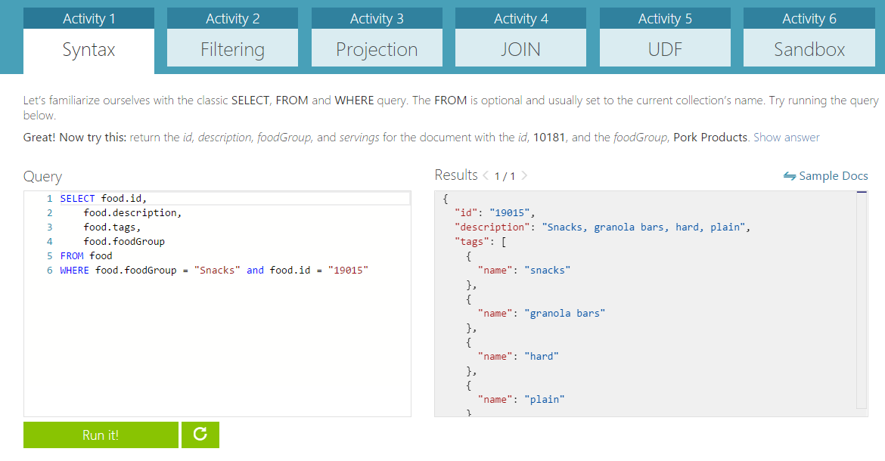

# Getting Started with Azure DocumentDB

**Azure DocumentDB** is a fully-managed, highly-scalable, NoSQL document database service provided by Azure. Its many benefits include rich query over a schema-free JSON data model, transactional execution of JavaScript logic, and scalable storage and throughput. You can find out more about DocumentDB online in the [Microsoft Azure subsite for DocumentDB](http://azure.microsoft.com/en-us/services/documentdb/).

In this lab, you will learn how to:

 * [Create a DocumentDB database account](#creating-a-documentdb-database-account)
 * [Import data using the DocumentDB data migration tool](#import-data-to-documentdb)

## Create a DocumentDB database account

1.	Sign in to the [Microsoft Azure Preview portal](https://portal.azure.com/).
2.	In the Jumpbar, click **New**, then select **Data + storage**, and then click **DocumentDB**. 

	![Screen shot of the Azure Preview portal, highlighting the New button, Data + storage in the Create blade, and DocumentDB in the Data + storage blade][1]   

	<!-- Alternatively, from the Startboard, you can browse the Azure Marketplace, select **Data + storage**, choose **DocumentDB**, and then click **Create**.  -->
	
	<!-- ![Screen shot of the Azure Preview portal, showing the Marketplace blade with the DocumentDB tile highlighted, and the DocumentDB blade with the Create button highlighted][2]    -->
   

3. In the **New DocumentDB** blade, specify the desired configuration for the DocumentDB account. 
 
	![Screen shot of the New DocumentDB blade][3] 

	- In the **Id** box, enter a name to identify the DocumentDB account. This value becomes the host name within the URI. The **Id** may contain only lowercase letters, numbers, and the '-' character, and must be between 3 and 50 characters. Note that *documents.azure.com* is appended to the endpoint name you choose, the result of which will become your DocumentDB account endpoint.

	- The **Account Tier** lens is locked because DocumentDB supports a single standard account tier. For more information, see [DocumentDB pricing](http://go.microsoft.com/fwlink/p/?LinkID=402317&clcid=0x409).

	- In **Resource group**, select or create a resource group for your DocumentDB account.  By default, a new Resource group will be created.  You may, however, choose to select an existing resource group to which you would like to add your DocumentDB account. For more information, see [Using resource groups to manage your Azure resources](resource-group-portal.md).

	- For **Subscription**, select the Azure subscription that you want to use for the DocumentDB account. If your account has only one subscription, that account will be selected automatically.
 
	- Use **Location** to specify the geographic location in which your DocumentDB account will be hosted.   

4.	Once the new DocumentDB account options are configured, click **Create**.  It will take ~10 minutes for the DocumentDB account to be created.  To check the status, you can monitor the progress on the Startboard.  
	![Screen shot of the Creating tile on the Startboard][4]  
  
	Or, you can monitor your progress from the Notifications hub.  

	![Screen shot of the Notifications hub, showing that the DocumentDB account is being created][5]  

	![Screen shot of the Notifications hub, showing that the DocumentDB account was created successfully and deployed to a resource group][6]

5.	While the account is provisioning, familiarize yourself with DocumentDB's SQL query grammer by trying out some sample queries on the [DocumentDB Query Playground](http://www.documentdb.com/sql/demo).

	

6.	After the DocumentDB account has been created, it is ready for use with the default settings.

	![Screen shot of the Resource Group blade][7]  

## Import data to DocumentDB

### Overview of the DocumentDB Data Migration Tool

The DocumentDB Data Migration tool is an open source solution that imports data to DocumentDB from a variety of sources, including:

- JSON files
- MongoDB
- SQL Server
- CSV files
- Azure Table storage
- DocumentDB collections

While the import tool includes a graphical user interface (dtui.exe), it can also be driven from the command line (dt.exe).  In fact, there is an option to output the associated command after setting up an import through the UI.  Tabular source data (e.g. SQL Server or CSV files) can be transformed such that hierarchical relationships (subdocuments) can be created during import.  Keep reading to learn more about source options, sample command lines to import from each source, target options, and viewing import results.

The migration tool is open source and can be found on GitHub in [this repository](https://github.com/azure/azure-documentdb-datamigrationtool) 

### Import JSON files

The JSON file source importer option allows you to import one or more single document JSON files or JSON files that each contain an array of JSON documents.  When adding folders that contain JSON files to import, you have the option of recursively searching for files in subfolders.

1.  Download the sample JSON data set from our Github repository.

2.	Download the migration tool from the [Microsoft Download Center](http://www.microsoft.com/downloads/details.aspx?FamilyID=cda7703a-2774-4c07-adcc-ad02ddc1a44d).

3.	Extract the migration tool to a directory of your choice.

4.	Run Dtui.exe to open the graphical interface version of the tool

5.	Once the **Welcome** screen displays, click **next** to proceed.

6.	On the **Source Information** screen, select the **JSON file(s)** option from the **Import from** drop-down menu.

	![Screenshot of JSON file source options][8]

7.	Click **Add Files** and select to the sample JSON data set you downloaded in step 1. Click **Next** to proceed.

8.	On the **Target Information** screen, you will see a number of export target options. The **DocumentDB - Bulk import** option allows you to import to a DocumentDB using a stored procedure for efficiency.  The tool will create, execute, and then delete the stored procedure from the target collection.

	![Screenshot of target options][9]

9.	On the **Azure Portal**, navigate to the **Keys blade** for your DocumentDB account. We will use these values as the export target in the next step.

	![Screen shot of the Azure Preview portal, showing a DocumentDB account, with the Keys button highlighted on the DocumentDB account blade, and the URI, PRIMARY KEY and SECONDARY KEY values highlighted on the Keys blade][10]

10.	In the import tool, fill in the **Connection String** using the following format.
	
	You can specify an existing DocumentDB database, or fill in the name for a new one and let the Import tool create it for you.

		AccountEndpoint=<DocumentDB Endpoint>;AccountKey=<DocumentDB Key>;Database=<DocumentDB Database>;

	> Note: Use the Verify command to ensure that the DocumentDB instance specified in the connection string field can be accessed. 

11.	Enter the name of the collection to which data will be imported and the desired pricing tier of the collection (S1, S2, or S3).  For best import performance, choose S3.

	> Note: The performance tier setting only applies to collection creation.  If the specified collection already exists, its pricing tier will not be modified.

	You may optionally specify which field in the import source should be used as the DocumentDB document id property during the import (note that if documents do not contain this property, then the import tool will generate a GUID as the id property value).

12. Click **Next** to proceed.

13. The **Summary** page allows you to review your source and target options. Once you are satisfied, click **Import**

	![Screenshot of summary][11]

14. The elapsed time, transferred count, and failure information will update as the import is in process. Once complete, you can export the results (e.g. to deal with any import failures).

	![Screenshot of results][12]

<!--Image references-->
[1]: media/ca1.png
[2]: media/ca2.png
[3]: media/ca3.png
[4]: media/ca4.png
[5]: media/ca5.png
[6]: media/ca6.png
[7]: media/ca7.png
[8]: media/jsonsource.png
[9]: media/docdbtarget.png
[10]: media/keys.png
[11]: media/summary.png
[12]: media/viewresults.png

[How to: Create a DocumentDB account]: #Howto
[Next steps]: #NextSteps
[documentdb-manage]:documentdb-manage.md
