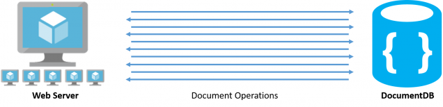
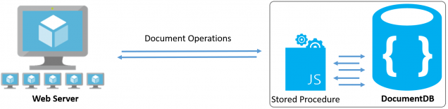

# Getting Started with Azure DocumentDB

**Azure DocumentDB** is a fully-managed, highly-scalable, NoSQL document database service provided by Azure. Its many benefits include rich query over a schema-free JSON data model, transactional execution of JavaScript logic, and scalable storage and throughput. You can find out more about DocumentDB online in the [Microsoft Azure subsite for DocumentDB](http://azure.microsoft.com/en-us/services/documentdb/).

In this lab, you will learn how to:

 * [Create a DocumentDB database account](#creating-a-documentdb-database-account)
 * [Import data using the DocumentDB data migration tool](#import-data-to-documentdb)
 * [Run queries using the DocumentDB Query Explorer](#run-queries-using-query-explorer)
 * [Create and execute a stored procedure using DocumentDB Studio](#sproc-docdb-studio)

## Create a DocumentDB database account

1.	Sign in to the [Microsoft Azure Preview portal](https://portal.azure.com/).
2.	In the Jumpbar, click **New**, then select **Data + storage**, and then click **DocumentDB**. 

	![Screen shot of the Azure Preview portal, highlighting the New button, Data + storage in the Create blade, and DocumentDB in the Data + storage blade][1]   

	<!-- Alternatively, from the Startboard, you can browse the Azure Marketplace, select **Data + storage**, choose **DocumentDB**, and then click **Create**.  -->
	
	<!-- ![Screen shot of the Azure Preview portal, showing the Marketplace blade with the DocumentDB tile highlighted, and the DocumentDB blade with the Create button highlighted][2]    -->
   

3. In the **New DocumentDB** blade, specify the desired configuration for the DocumentDB account. 
 
	![Screen shot of the New DocumentDB blade][3] 

	- In the **Id** box, enter a name to identify the DocumentDB account. This value becomes the host name within the URI. The **Id** may contain only lowercase letters, numbers, and the '-' character, and must be between 3 and 50 characters. Note that *documents.azure.com* is appended to the endpoint name you choose, the result of which will become your DocumentDB account endpoint.

	- The **Account Tier** lens is locked because DocumentDB supports a single standard account tier. For more information, see [DocumentDB pricing](http://go.microsoft.com/fwlink/p/?LinkID=402317&clcid=0x409).

	- In **Resource group**, select or create a resource group for your DocumentDB account.  By default, a new Resource group will be created.  You may, however, choose to select an existing resource group to which you would like to add your DocumentDB account. For more information, see [Using resource groups to manage your Azure resources](resource-group-portal.md).

	- For **Subscription**, select the Azure subscription that you want to use for the DocumentDB account. If your account has only one subscription, that account will be selected automatically.
 
	- Use **Location** to specify the geographic location in which your DocumentDB account will be hosted.   

4.	Once the new DocumentDB account options are configured, click **Create**.  It will take ~10 minutes for the DocumentDB account to be created.  To check the status, you can monitor the progress on the Startboard.  
	![Screen shot of the Creating tile on the Startboard][4]  
  
	Or, you can monitor your progress from the Notifications hub.  

	![Screen shot of the Notifications hub, showing that the DocumentDB account is being created][5]  

	![Screen shot of the Notifications hub, showing that the DocumentDB account was created successfully and deployed to a resource group][6]

5.	While the account is provisioning, familiarize yourself with DocumentDB's SQL query grammar by trying out some sample queries on the [DocumentDB Query Playground](http://www.documentdb.com/sql/demo).

	![Screenshot of query playground][0]

6.	After the DocumentDB account has been created, it is ready for use with the default settings.

	![Screen shot of the Resource Group blade][7]  

## Import data to DocumentDB

### Overview of the DocumentDB Data Migration Tool

The DocumentDB Data Migration tool is an open source solution that imports data to DocumentDB from a variety of sources, including:

- JSON files
- MongoDB
- SQL Server
- CSV files
- Azure Table storage
- DocumentDB collections

While the import tool includes a graphical user interface (dtui.exe), it can also be driven from the command line (dt.exe).  In fact, there is an option to output the associated command after setting up an import through the UI.  Tabular source data (e.g. SQL Server or CSV files) can be transformed such that hierarchical relationships (subdocuments) can be created during import.  Keep reading to learn more about source options, sample command lines to import from each source, target options, and viewing import results.

The migration tool is open source and can be found on GitHub in [this repository](https://github.com/azure/azure-documentdb-datamigrationtool) 

### Import JSON files

The JSON file source importer option allows you to import one or more single document JSON files or JSON files that each contain an array of JSON documents.  When adding folders that contain JSON files to import, you have the option of recursively searching for files in subfolders.

1.  Download the [sample JSON data set](https://raw.githubusercontent.com/aliuy/azure-documentdb-labs/master/DataCamp/AWProductsAndCategories.json) from our GitHub repository.

2.	Download the migration tool from the [Microsoft Download Center](http://www.microsoft.com/downloads/details.aspx?FamilyID=cda7703a-2774-4c07-adcc-ad02ddc1a44d).

3.	Extract the migration tool to a directory of your choice.

4.	Run **Dtui.exe** to open the graphical interface version of the tool

5.	Once the **Welcome** screen displays, click **next** to proceed.

6.	On the **Source Information** screen, select the **JSON file(s)** option from the **Import from** drop-down menu.

	![Screenshot of JSON file source options][8]

7.	Click **Add Files** and select to the sample JSON data set you downloaded in step 1. Click **Next** to proceed.

8.	On the **Target Information** screen, you will see a number of export target options. The **DocumentDB - Bulk import** option allows you to import to a DocumentDB using a stored procedure for efficiency.  The tool will create, execute, and then delete the stored procedure from the target collection.

	![Screenshot of target options][9]

9.	On the **Azure Portal**, navigate to the **Keys blade** for your DocumentDB account. We will use these values as the export target in the next step.

	![Screen shot of the Azure Preview portal, showing a DocumentDB account, with the Keys button highlighted on the DocumentDB account blade, and the URI, PRIMARY KEY and SECONDARY KEY values highlighted on the Keys blade][10]

10.	In the import tool, fill in the **Connection String** using the following format.
	
	You can specify an existing DocumentDB database, or fill in the name for a new one and let the Import tool create it for you.

		AccountEndpoint=<DocumentDB Endpoint>;AccountKey=<DocumentDB Key>;Database=<DocumentDB Database>;

	> Note: Use the Verify command to ensure that the DocumentDB instance specified in the connection string field can be accessed. 

11.	Enter the name of the collection to which data will be imported and the desired pricing tier of the collection (S1, S2, or S3).  For best import performance, choose S3.

	> Note: The performance tier setting only applies to collection creation.  If the specified collection already exists, its pricing tier will not be modified.

	You may optionally specify which field in the import source should be used as the DocumentDB document id property during the import (note that if documents do not contain this property, then the import tool will generate a GUID as the id property value).

12. Click **Next** to proceed.

13. The **Summary** page allows you to review your source and target options. Once you are satisfied, click **Import**

	![Screenshot of summary][11]

14. The elapsed time, transferred count, and failure information will update as the import is in process. Once complete, you can export the results (e.g. to deal with any import failures).

	![Screenshot of results][12]

##  Run queries using the DocumentDB Query Explorer

The DocumentDB Query Explorer enables you to create, edit, and run queries against a DocumentDB collection. The Query Explorer can be launched from the Azure Portal from any of the DocumentDB account, database, and collection blades.
  
1. Near the bottom of each DocumentDB blade is a **Developer Tools** lens, which contains the **Query Explorer** tile.
	
	![Screenshot of Query Explorer part][13] 

2. Simply click the tile to launch Query Explorer.

	![Screenshot of Query Explorer][14]

3. Select the Database and Collection you created in the previous section.

4. Try running following queries, and examine the query results:

	* Grab all the product documents

			SELECT *
			FROM Products

	* Select a specific product by ProductNumber

			SELECT *
			FROM Products p
			WHERE p.ProductNumber = "BK-M38S-42"

	* Select a specific properties
	
		> Note: the referencing hierarchy in the SELECT clause.

			SELECT	p.id, p.Name, p.Description,
					p.Size, p.Weight,
					p.Category.Name as Category
			FROM Products p
			WHERE p.ProductNumber = "BK-M38S-42"

	* Now try using the [advanced query operators](http://azure.microsoft.com/en-us/documentation/articles/documentdb-sql-query/#in-keyword), such as the `IN` operator.

			SELECT p.id, p.Name
			FROM Products p
			WHERE p.id IN ("680","706","707","708")

	* Use [built in system functions](http://azure.microsoft.com/en-us/documentation/articles/documentdb-sql-query/#built-in-functions) to convert weight from grams to pounds

			SELECT p.id, p.Name, p.Description,
			p.Size, 
			p.Weight as WeightGrams,
			ROUND(p.Weight*0.0022046) as WeightLbs,
			p.Category.Name as Category
			FROM Products p
			WHERE p.ProductNumber = "BK-M38S-42"

	* Get another type of document in this collection

		 > Note: the nested arrays inside the documents from the query result.

			SELECT *
			FROM ProductCategories pc 
			WHERE pc.DocType = "ProductCategory"

	* Use the `JOIN` operator to perform a cross-product with nested array elements.

			SELECT pc.CategoryName, c.SubCategoryName as SubCategory
			FROM ProductCategories pc 
			JOIN c IN pc.SubCategories
			WHERE pc.DocType = "ProductCategory"

	* You can construct JSON as part of the query projection.

			SELECT {
				"category": pc.CategoryName,
				"subcategory": c.SubCategoryName,
				"categoryid": pc.CategoryId*10000+c.SubCategoryId
			} 
			AS productcategory
			FROM ProductCategories pc 
			JOIN c IN pc.SubCategories
			WHERE pc.DocType = "ProductCategory"

## Create and execute a Stored Procedure using DocumentDB Studio

### Overview of DocumentDB's Server-Side JavaScript

Azure DocumentDB supports the transactional execution of JavaScript logic natively inside the database engine. The approach of using JavaScript as a modern day T-SQL provides developers a rich and familiar interface to implement business logic. This is expressed in the form of stored procedures, triggers, and user-defined functions (UDFs). In this section, we will take a closer look at DocumentDB’s interpretation of stored procedures.

A major advantage with stored procedures is that they enable applications to perform complex batches and sequences of operations directly inside the database engine, closer to the data. Developers can group and sequence operations (like inserts, updates, or deletes) and submit them together. The benefit here is that the network traffic latency costs for batching and sequencing operations can completely avoided.

	 
	
	 
	<i>A sequence of database operations.</i>
	 

	 
	
	 
	<i>A sequence of database operations using Stored Procedures.</i>
	 

Another important thing to note is that DocumentDB offers full ACID (Atomicity, Consistency, Isolation, and Durability) guarantees for all operations that take part of a single stored procedure. In other words, stored procedures enable applications to combine related operations in a single batch so that either all of them succeed or none of them succeed. This is interesting because few NoSQL databases provide ACID transactions across multiple documents / records.

### Managing server-side scripts with DocumentDB Studio

To easily create and execute a stored procedure, let's take a look at the Azure DocumentDB Studio.

The Azure DocumentDB Studio is an open-source client viewer/explorer for managing your Azure DocumentDB service. It features the ability to:

- Easily browse DocumentDB resources and learn more about the DocumentDB resource model. 
- Perform Create, Read, Update, Delete (CRUD) and Query operations for every DocumentDB resource. 
- Create and execute Server-Side Javascript (Stored Procedures, Triggers, and User-Defined Functions). 
- Inspect headers (e.g. RU charge) for every request operation.

Let's get started...

1.	Download the DocumentDB Studio from its [Github repository](https://github.com/mingaliu/DocumentDBStudio/releases). You can get the latest compiled binary by clicking the [DocumentDbStudio.zip](https://github.com/mingaliu/DocumentDBStudio/releases/download/0.50/DocumentDbStudio.zip) link.

2.	Extract DocumentDbStudio.zip to a directory of your choice.

3.	Run **DocumentDBStudio.exe** to open the application.

4.	Click **File** => **Add Account** to add your DocumentDB account.

5.	Fill in your DocumentDB account's endpoint and authentication key in to the pop-up dialogue box. Click **OK** to proceed.

	> Note: You can find this info in the DocumentDB Account Key's blade in the Azure Portal.

	![Screen shot of the DocumentDB Studio Account Settings dialogue box][15]

6.	Navigate to the collection you created in the previous sections by expanding your DocumentDB account, database, and collection in the left-navigation.

	![Screen shot of the DocumentDB Studio][16]

7.	Right click **StoredProcedures** on the left-navigation and click **Create StoredProcedure**

	![Screen shot of the DocumentDB Studio][17]

8.	The following example Stored Procedure enables users to review products with a numeric rating and comment.

	The script updates an existing product document to hold a product rating object (which contains a moving average for multiple product ratings) and creates a new review document containing the reviewer's name and comments as an atomic transaction.

	Fill in `reviewProduct` as the **Id** for the new Stored Procedure.

	And copy + paste the following script as the Stored Procedure's body:

        /**
         * A DocumentDB stored procedure for reviewing a product. 
         *
         * @function
         * @param {string} productNumber - The ProductNumber for the product being reviewed.
         * @param {string} reviewer - The name of the reviewer.
         * @param {number} rating - A numerical product rating for the review.
         * @param {string} comment - The reviewer's comments.
         */
        function reviewProduct(productNumber, reviewer, rating, comment) {
            var collection = getContext().getCollection();
            var collectionLink = collection.getSelfLink();
            var response = getContext().getResponse();
        
            // Validate input.
            if (typeof productNumber != "string") throw new Error("The productNumber is invalid.");
            if (typeof reviewer != "string") throw new Error("The reviewer is invalid.");
            if (typeof rating != "number") throw new Error("The rating is invalid.");
            if (typeof comment != "string") throw new Error("The comment is invalid.");
        
            // Create a review document and update the product.
            createReviewDoc(productNumber, reviewer, rating, comment, function (error, reviewDoc) {
                if (error) throw error;
        
                // Update the product document.
                updateProductDoc(productNumber, rating, function(error, productDoc) {
                    if(error) throw error;
        
                    var responseBody = {
                        product: productDoc,
                        review: reviewDoc
                    }
        
                    // Return the new review document and updated product document in the response.
                    response.setBody(responseBody);
                })
            });
        
            // Helper Functions
            /*
             * Creates a rating document.
             */
            function createReviewDoc(productNumber, reviewer, rating, comment, callback) {
                var ratingDoc = {
                    productNumber: productNumber,
                    reviewer: reviewer,
                    rating: rating,
                    comment: comment
                }
        
                var isAccepted = collection.createDocument(collectionLink, ratingDoc, function (error, document) {
                    if (error) throw error;
        
                    callback(error, document);
                });
        
                if (!isAccepted) throw new Error("Failed to create rating document.");
            }
        
            /*
             * Creates or updates the Rating property inside a product document.
             */
            function updateProductDoc(productNumber, rating, callback) {
        
                // Query for the product.
                var query = {
                    query: "select * from root r where r.ProductNumber = @id",
                    parameters: [{name: "@id", value: productNumber}]
                };
                var isAccepted = collection.queryDocuments(collectionLink, query, {}, function (error, documents) {
                    if (error) throw error;
                    if (documents.length != 1) throw new Error("Invalid Product Id")
        
                    var productDoc = documents[0];
        
                    // Update the product rating if it already exists; otherwise create a new product rating object.
                    if (productDoc.Rating && productDoc.Rating.score && productDoc.Rating.weight) {
                        var updatedRating = {
                            weight: productDoc.Rating.weight + 1,
                            score: (productDoc.Rating.score * productDoc.Rating.weight + rating) / (productDoc.Rating.weight + 1)
                        }
                        productDoc.Rating = updatedRating;
                    } else {
                        productDoc.Rating = {
                            score: rating,
                            weight: 1
                        };
                    }
        
                    // Replace the existing document.
                    var isAccepted = collection.replaceDocument(productDoc._self, productDoc, {}, function (err, updatedDocument) {
                        if (error) throw error;
        
                        callback(error, updatedDocument);
                    });
        
                    if (!isAccepted) throw new Error("Failed to update product document.");
                });
        
                if (!isAccepted) throw new Error("Failed to query product document.");
            }
        }

9.	Click **Execute** in the top bar to finish creating the Stored Procedure.

10. Expand StoredProcedures in the left-navigation to see your new Stored Procedure.

11. Let's review a product in our dataset. Right click the StoredProcedure to open a context menu and then click **Execute StoredProcedure**.

	![Screen shot of the DocumentDB Studio][18]

12. Fill in the following input parameters in the Execute StoredProcedure pane:

		"BK-M38S-42"
		"Andrew Liu"
		10
		"This mountain bike rocks!"

	![Screen shot of the DocumentDB Studio][19]

13.	Click **Execute** in the top bar to finish executing the Stored Procedure.

	In the response, we can see the following Ratings object was appended to the appropriate product document:

	    "Rating": {
	        "score": 10,
	        "weight": 1
	    }

	And a new review document has been created:

		{
		    "productNumber": "BK-M38S-42",
		    "reviewer": "Andrew Liu",
		    "rating": 10,
		    "comment": "This mountain bike rocks!"
		}

14. Let's add a second review for the product. Repeat steps 11 - 13 with a different set of input parameters:

		"BK-M38S-42"
		"Stephen Baron"
		0
		"This mountain bike is terrible!"

15. In the response, we can see the product's Rating object has been updated:

	    "Rating": {
	        "weight": 2,
	        "score": 5
	    }

	And the following review document has been created:

		{
		   "productNumber": "BK-M38S-42",
		   "reviewer": "Stephen Baron",
		   "rating": 0,
		   "comment": "This mountain bike is terrible!"
		}

16.	Now let's try to add an invalid review for the product to demonstrate the robust qualities of Stored Procedures. Stored Procedures enable multi-document transactions and automatically rollback transactions whenever an exception is thrown. For example, you may want to throw an exception and rollback if your input parameters fail validation.

	Let's try running the Stored Procedure again with another set of parameters:

		"BK-M38S-42"
		"John Macintyre"
		"An Invalid Rating"
		"I like IPAs!"

17. In the response, we can see an exception is thrown and therefore the product document has not been updated:

		Microsoft.Azure.Documents.DocumentClientException: Message: {
		    "Errors": ["Encountered exception while executing Javascript. Exception = Error: The rating is invalid.
		                Stack trace: Error: The rating is invalid.
		                    at reviewProduct(reviewProduct.js: 18: 36)
		                    at __docDbMain(reviewProduct.js: 105: 5)
		                    at Unknown script code(reviewProduct.js: 1: 2)
		            "]
		}

18. We can verify that the product document has not been updated by querying for it:

		SELECT products.Rating
		FROM products
		WHERE products.ProductNumber = "BK-M38S-42"

	which returns:

		[{
		    Rating: {
		        weight: 2,
		        score: 5
		    }
		}]

	> Note: you can use the Azure DocumentDB Studio to query for documents.
	
	![Screen shot of the DocumentDB Studio][22]

##Appendix - Cleanup

In this task you will learn how to delete the DocumentDB account you created in the previous sections.

1. In your browser, go to [the Azure management portal](https://portal.azure.com/), and sign in with your Azure credentials.

2. Click **BROWSE** in the Navigation hub on the left and then **DocumentDB accounts**.

3. Click your documentDB account and in the details blade that opens, click **Delete**.

	![Accessing the just created DocumentDB account][20]

4. In the confirmation blade that appears, type your documentDB account name and click **Delete**. The account will be deleted.

	![Confirming deletion of DocumentDB account][21]

##Summary

By completing this lab you have learned how to get started with Azure DocumentDB. This includes creating a new account, importing data, running queries, and executing a stored procedure. For more information, please check out our [website](http://www.documentdb.com).

<!--Image references-->
[0]: media/queryplayground.png
[1]: media/ca1.png
[2]: media/ca2.png
[3]: media/ca3.png
[4]: media/ca4.png
[5]: media/ca5.png
[6]: media/ca6.png
[7]: media/ca7.png
[8]: media/jsonsource.png
[9]: media/docdbtarget.png
[10]: media/keys.png
[11]: media/summary.png
[12]: media/viewresults.png
[13]: media/queryexplorerpart.png
[14]: media/queryexplorerinitial.png
[15]: media/docdbstudio-addaccount.png
[16]: media/docdbstudio-sproc-feed.png
[17]: media/docdbstudio-sproc-menu.png
[18]: media/docdbstudio-sproc-menu2.png
[19]: media/docdbstudio-sproc-input.png
[20]: media/accessing-the-new-documentdb-account.png
[21]: media/confirm-deletion-of-documentdb-account.png
[22]: media/docdbstudio-query-results.png
